<div align="center">

<!-- Animated Header -->


<!-- Badges -->
<p>
  
  
  
  
</p>

<p>
  
  
  
</p>

<!-- Typing Animation -->
<a href="https://git.io/typing-svg"></a>

<br/>

### 🚀 An Institutional-Grade Quantitative Trading Platform

</div>

---

## 🎯 What Is This?

A **complete quantitative trading system** that combines:

<table>
<tr>
<td width="50%" align="center">

### 🧠 RiskFusion Alpha
**The Trading Engine**

- XGBoost ML for alpha prediction
- Convex portfolio optimization (CVXPY)
- Regime detection (Hidden Markov)
- Live/Paper trading via Alpaca

[📖 View Docs →](./riskfusion_alpha/README.md)

</td>
<td width="50%" align="center">

### 📊 QuantDash
**The Control Center**

- 60fps animated visualizations (PixiJS)
- Real-time portfolio monitoring
- Bot start/stop controls
- Bloomberg-grade aesthetics

[📖 View Docs →](./quant-car/README.md)

</td>
</tr>
</table>

---

## ✨ Key Features

```mermaid
graph LR
    subgraph Data
        A[📈 Polygon] --> D[Ingest]
        B[📰 News] --> D
        C[📊 Events] --> D
    end
    
    subgraph ML Engine
        D --> E[Features]
        E --> F[🧠 Alpha Model]
        E --> G[📊 Vol Model]
        F & G --> H[Optimizer]
    end
    
    subgraph Execution
        H --> I[📱 Alpaca]
        I --> J[💰 Orders]
    end
    
    subgraph Dashboard
        H --> K[📊 QuantDash]
        K --> L[60fps Visuals]
    end
    
    style F fill:#667eea
    style H fill:#764ba2
    style K fill:#f093fb
```



---

## 🚀 Quick Start

### 1. Clone
```bash
git clone https://github.com/tokunboajayi/Quant-analysis-trading-bot.git
cd Quant-analysis-trading-bot
```

### 2. Install RiskFusion
```bash
cd riskfusion_alpha
pip install -e .[dev]
cp .env.example .env
# Add your API keys to .env
```

### 3. Start Dashboard
```bash
# Terminal 1: API
cd quant-car/apps/api
pip install -r requirements.txt
uvicorn app.main:app --port 8000

# Terminal 2: Frontend
cd quant-car/apps/cockpit
npm install && npm run dev
```

### 4. Run the Bot
```bash
# Paper trading (safe)
EXECUTION_MODE=PAPER python -m riskfusion.cli run_daily
```

🌐 Open **http://localhost:3000/control** to manage the bot!

---

## 📁 Project Structure

```
.
├── riskfusion_alpha/           🧠 Trading Engine (Python)
│   ├── riskfusion/
│   │   ├── cli.py              # Entry point
│   │   ├── daily_runner.py     # Pipeline orchestration
│   │   ├── models/             # ML models (XGBoost, HMM)
│   │   ├── portfolio/          # Optimization (CVXPY)
│   │   └── execution/          # Alpaca integration
│   └── tests/                  # Pytest suite
│
└── quant-car/                  📊 Dashboard (TypeScript)
    ├── apps/api/               # FastAPI backend
    └── apps/cockpit/           # Next.js + PixiJS frontend
```

---

## 🔒 Security

| Feature | Description |
|---------|-------------|
| **Paper Mode** | Default for safety |
| **Live Trading** | Requires `ALLOW_LIVE_TRADING=1` |
| **API Keys** | Stored in `.env` (gitignored) |
| **Audit Logs** | Full history in SQLite |

---

## 📜 License

MIT License - see [LICENSE](./LICENSE)

---

<div align="center">

### ⭐ Star this repo if you find it useful!


</div>
