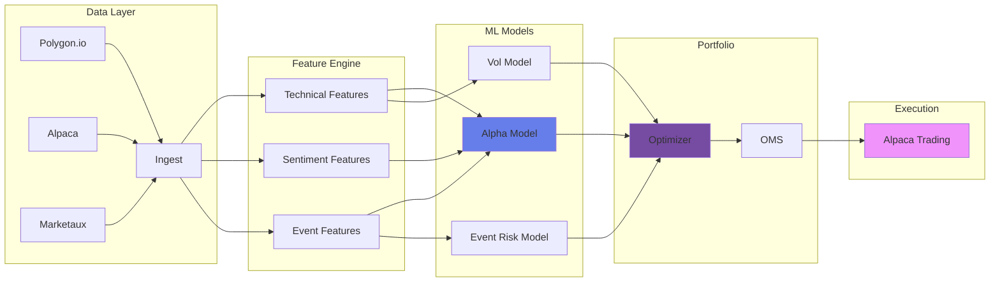

<div align="center">

<!-- Animated Header -->


<!-- Animated Badges -->
<p>
  
  
  
  
</p>

<p>
  
  
  
</p>

<!-- Typing Animation -->
<a href="https://git.io/typing-svg"></a>

</div>

---

## 🚀 What is RiskFusion?

**RiskFusion Alpha** is a production-grade quantitative trading system that combines:

- 🧠 **Machine Learning Alpha** — XGBoost models for cross-sectional stock prediction
- 📊 **Multi-Factor Risk Model** — Volatility forecasting + event risk overlays
- ⚡ **Automated Execution** — Live/Paper trading via Alpaca Markets API
- 🔮 **Regime Detection** — Hidden Markov Models for market state awareness
- 📈 **Real-time Dashboard** — Bloomberg-style monitoring via QuantDash

<div align="center">
  
</div>

---

## ✨ Key Features

<table>
<tr>
<td width="50%">

### 🎯 Alpha Generation
- Cross-sectional momentum signals
- Sentiment analysis from news
- Technical indicators (RSI, MACD, etc.)
- Graph-based features (sector correlations)

</td>
<td width="50%">

### 🛡️ Risk Management
- CVXPY portfolio optimization
- Inverse volatility weighting
- Event risk overlays (earnings, FDA)
- Position concentration limits

</td>
</tr>
<tr>
<td width="50%">

### 🔬 Research Tools
- Walk-forward backtesting
- Hyperparameter optimization (Optuna)
- Ablation studies
- Feature drift monitoring

</td>
<td width="50%">

### 🏭 Production Ready
- Model registry with staging gates
- Comprehensive audit logging
- SQLite persistence layer
- Docker containerization

</td>
</tr>
</table>

---

## 🏗️ Architecture



---

## ⚡ Quick Start

### 1. Clone & Install

```bash
git clone https://github.com/yourusername/riskfusion-alpha.git
cd riskfusion-alpha
pip install -e .[dev]
```

### 2. Configure

```bash
cp .env.example .env
# Edit .env with your API keys:
# - POLYGON_API_KEY
# - ALPACA_API_KEY / ALPACA_SECRET_KEY
```

### 3. Run Daily Pipeline

```bash
# Paper trading (safe)
EXECUTION_MODE=PAPER python -m riskfusion.cli run_daily

# Live trading (real money!)
EXECUTION_MODE=LIVE ALLOW_LIVE_TRADING=1 python -m riskfusion.cli run_daily
```

---

## 📊 CLI Commands

| Command | Description |
|---------|-------------|
| `run_daily` | Execute full pipeline (ingest → predict → trade) |
| `backtest --start 2023-01-01 --end 2024-01-01` | Run historical backtest |
| `ablation --steps 0,1,2,3` | Compare feature ladder ablation |
| `validate_research` | Permutation tests for statistical validity |
| `registry list --stage prod` | View production models |

---

## 🖥️ Dashboard (QuantDash)

The companion dashboard provides real-time monitoring:

<div align="center">

| Feature | Description |
|---------|-------------|
| 📈 **Portfolio View** | Live positions & P&L |
| 🚦 **Pipeline Status** | Step-by-step execution tracker |
| 🎮 **Bot Control** | Start/Stop/Run-Once from UI |
| ⚠️ **Alerts** | Drift detection & warnings |

</div>

---

## 📁 Project Structure

```
riskfusion_alpha/
├── riskfusion/
│   ├── ingest/          # Data ingestion (prices, events)
│   ├── features/        # Feature engineering
│   ├── models/          # ML models (alpha, vol, regime)
│   ├── portfolio/       # Optimization & construction
│   ├── execution/       # Order management (Alpaca)
│   ├── research/        # Backtesting, walk-forward, HPO
│   ├── monitoring/      # Drift detection, reports
│   └── cli.py           # Command-line interface
├── configs/             # YAML configuration
├── data/                # Raw/processed data (gitignored)
├── tests/               # Pytest test suite
└── docs/                # Documentation
```

---

## 🔒 Security

- **API Keys**: Stored in `.env` (gitignored)
- **Live Trading**: Requires explicit `ALLOW_LIVE_TRADING=1`
- **Paper Mode**: Default for safety
- **Audit Logs**: Full run history in SQLite

---

## 🤝 Contributing

1. Fork the repository
2. Create feature branch (`git checkout -b feature/amazing-feature`)
3. Commit changes (`git commit -m 'Add amazing feature'`)
4. Push to branch (`git push origin feature/amazing-feature`)
5. Open a Pull Request

---

## 📜 License

This project is licensed under the MIT License - see the [LICENSE](LICENSE) file for details.

---

<div align="center">

### ⭐ Star this repo if you find it useful!


</div>
